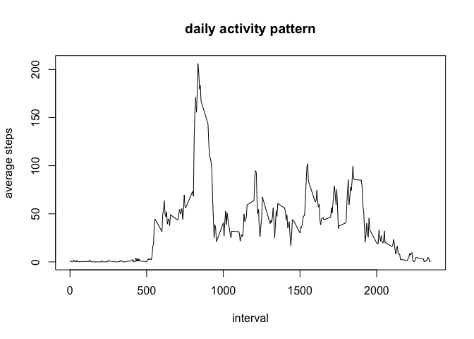

# Reproducible Research: Peer Assessment 1


## Loading and preprocessing the data
1. Load the data  

```r
activity = read.csv('activity.csv')
```

2. Process the data: convert the date values to Date objects

```r
suppressMessages(library(lubridate))
activity$date = ymd(activity$date)
```

## What is mean total number of steps taken per day?
1. Calculate the total number of steps taken per day

```r
steps_per_day = aggregate(steps~date,activity,sum)
```

2. Make a histogram of the total number of steps taken per day

```r
hist(steps_per_day$steps, breaks=10, xlab='steps', 
     main='Total steps taken per day')
```

<!-- -->

3. Calculate and report the mean and median of the total number of steps taken per day

```r
mean(steps_per_day$steps, na.rm=TRUE)
```

```
## [1] 10766.19
```

```r
median(steps_per_day$steps, na.rm=TRUE)
```

```
## [1] 10765
```

## What is the average daily activity pattern?
1. Make a time series plot of the 5-minute interval and the average number of steps taken, averaged across all days

```r
interval_steps = aggregate(steps~interval,activity,mean)
with(interval_steps, plot(interval,steps,type='l', ylab = 'average steps',
                          main='daily activity pattern'))
```

<!-- -->

2. Which 5-minute interval, on average across all the days in the dataset, contains the maximum number of steps?

```r
with(interval_steps, interval[which.max(steps)])
```

```
## [1] 835
```

## Imputing missing values
1. Calculate and report the total number of missing values in the dataset

```r
sum(is.na(activity$steps))
```

```
## [1] 2304
```

2. Devise a strategy for filling in all of the missing values in the dataset.  
The code below replaces missing values with the average number of steps taken in the same interval.  

3. Create a new dataset that is equal to the original dataset but with the missing data filled in

```r
for (i in which(is.na(activity$steps))) {
    curr_interval = activity[i,'interval']
    replacement = interval_steps[interval_steps$interval==curr_interval,'steps']
    activity[i,'steps'] = replacement
}
new_steps_per_day = aggregate(steps~date,activity,sum)
```

4. Make a histogram of the total number of steps taken each day and calculate and report the mean and median total number of steps taken per day

```r
hist(new_steps_per_day$steps, breaks=10, xlab='steps', main='Steps taken per day')
```

<!-- -->

```r
mean(new_steps_per_day$steps, na.rm=TRUE)
```

```
## [1] 10766.19
```

```r
median(new_steps_per_day$steps, na.rm=TRUE)
```

```
## [1] 10766.19
```

The mean number of steps per day is unchanged, but the median steps per day is slightly higher.

## Are there differences in activity patterns between weekdays and weekends?
1. Create a new factor variable in the dataset with two levels - "weekday" and "weekend" indicating whether a given date is a weekday or weekend day.

```r
is_weekend = weekdays(activity$date) %in% c('Saturday','Sunday')
activity['is_weekend'] = 'Weekday'
activity[is_weekend, 'is_weekend'] = 'Weekend'
```

2. Make a panel plot containing a time series plot of the 5-minute interval and the average number of steps taken, averaged across all weekday days or weekend days

```r
new_interval_steps = aggregate(steps~interval+is_weekend, activity, mean)
suppressWarnings(library(ggplot2))
g = ggplot(new_interval_steps, mapping=aes(interval,steps)) +
    geom_line() + facet_grid(is_weekend~.) + labs(title='daily activity pattern')
print(g)
```

<!-- -->
